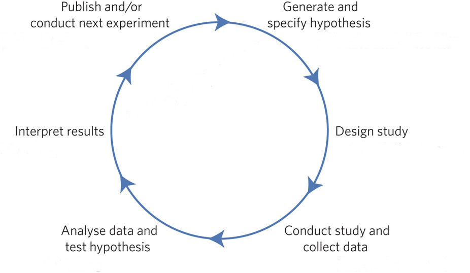
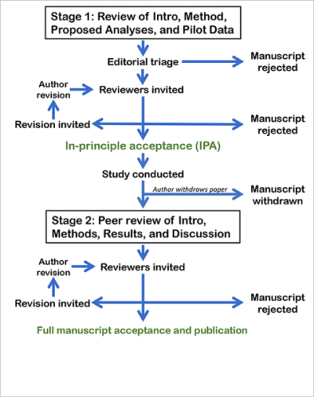

# <small> What did we do last session?</small>

----

We did some Q&A

----

... learned how to do graphics with R

----

... and fought an ever increasing  
feeling of desperation

----

Any questions or anything to add?


# <small>Last session's homework</small>

----

Who of you added graphics to your slides?

----

... added graphics to your R Notebooks?

----

Any questions regarding  
last session's homework?


# <small>Today:<br>Putting it all together</small>


# <small>The bigger picture</small>

----

The hypothetico-deductive model (Munafo et al. 2017)  
  
<small>Source (edited): https://media.nature.com/lw926/nature-assets/nathumbehav/2017/s41562-016-0021/images_hires/s41562-016-0021-f1.jpg</small>

----


Registered reports  


<small>Source: https://cos.io/rr/</small>

----

Registered reports  



# <small>What we did so far</small>

## <small>The proposal presentations</small>

- R Presentation including:  
- Introduction, Methods,  
Proposed analysis,  
References  

## <small>Data collection</small>

- R Script to collect:  
- Google trends data  
- Optional additional data  

## <small>Data analysis</small>

- R Script to analyze data using:  
- t-tests  
- correlation  

## <small>Data analysis</small>

- R Notebook to:  
- document your code  
- include graphics  

## <small>Data visualization</small>

- R Script to generate:  
- various types of graphics  
- using to ggplot2 package  

## <small>Any questions or anything to add?</small>


# <small>What is left to do</small>

----

Report result - automatically

----

Add a discussion section

----

Add references - automatically


# <small>Report result - automatically</small>


## <small>Generate data</small>

```{r message=FALSE}
a <- 1:30; b <- 20:50
result <- t.test(x = a, y = b)
```

## <small>Add inline code</small>

```{}
On average depression levels were lower for group A 
(M = 'r mean(a)', SD = 'r round(sd(a), 2)') compared 
to group B (M = 'r mean(b)', SD = 'r round(sd(b), 2)').
```

```{}
This difference was significant 
t('r round(result$parameter, 2)') = 
'r round(result$statistic, 2)', p < 0.01.
```

## <small>Instant report</small>

```{}
On average depression levels were lower 
for group A (M = `r mean(a)`, SD = `r round(sd(a), 2)`) compared 
to group B (M = `r mean(b)`, SD = `r round(sd(b), 2)`).


This difference was significant 
t(`r round(result$parameter, 2)`) = `r round(result$statistic, 2)`, p < 0.01.
```


# <small>Add a discussion section</small>

----

Interpret your results  

----

Add some future implications  


# <small>Add references - automatically</small>

----

Export your Zotero library

----

Link you library in your  
R Markdown document

----

Add CSL style

----

Add references like this [@Munafomanifestoreproduciblescience2017]

----

Generate reference list
<div id="refs"></div>

# <small>Any questions?</small>


# <small>Preview: next session</small>

----

"Final presentations"

----

Please post a link to the slides  
for your group's presentation on the  
\#final_presentation channel in Slack

----

Please also make the preregistrations  
for your group's project available on the  
\#final_presentation channel in Slack

----

# <small>Homework</small>

----

Finish your slides

----

Finish your RNotebook

----

# <small>Any questions?</small>


# <small>Thank you for your attention</small>
